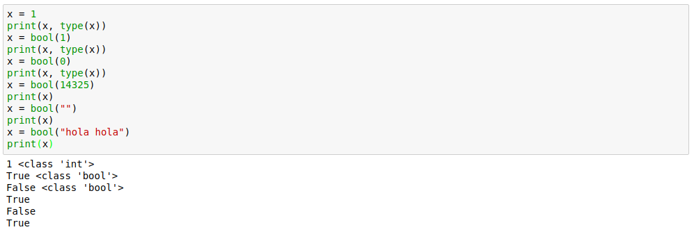
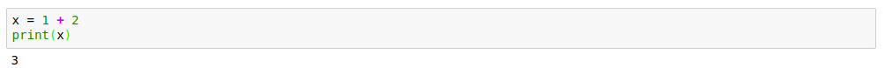
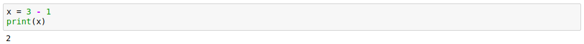
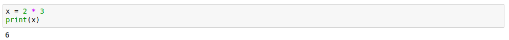
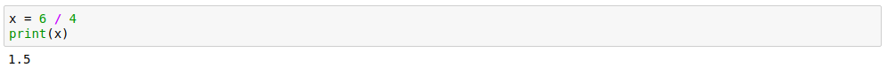
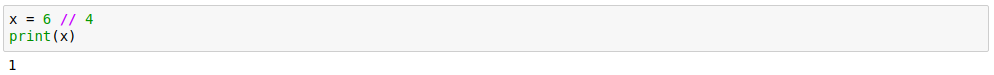
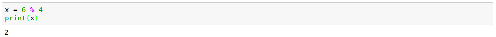
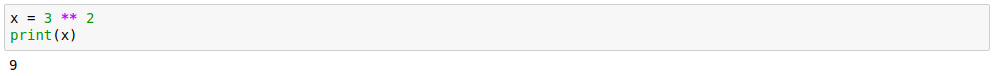
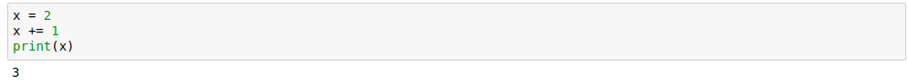

# Primeros pasos Python3.6

___

# Librerías estandar

Existen una serie de funciones predefinidas en python que podemos usar en cualquier momento: https://docs.python.org/3/library/functions.html

___

# Tipos de datos principales

### Variables

Las variables siempre pertenecen a un tipo de dato.

Para imprimir por pantalla lo que deseemos usaremos: `print`

## Conversiones de tipos de datos

- Str -> int :

  

- Coversiones a booleanos(1/0 - True/False):

  

___

# Operaciones con números.

- Suma: `+`

  

- Resta: `-`

  

- Multiplicación: `*`

  

- División: `/`

  

- División (resultado sin comas): `//`

  

- Resto/módulo: `%`

  

- Cuadrado: `**`

  

> Tener en cuenta que las operaciones en Python se siguen las reglas de prioridad. multiplicaciones/divisiones/paréntesis, etc...

## Operadores compactos.

En este caso veremos como compactar una operación
> En este ejemplo veremos como x += 1  es lo mismo que x = x + 1, esto se puede hacer con otros operadores también.

