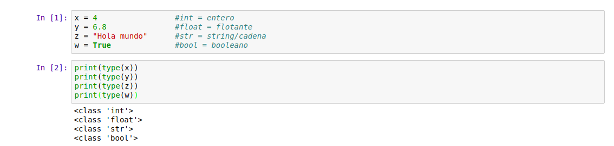
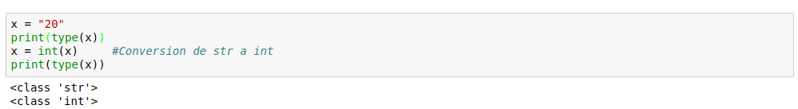

# Primeros pasos Python3.6

___

# Librerías estandar

Existen una serie de funciones predefinidas en python que podemos usar en cualquier momento: https://docs.python.org/3/library/functions.html

___

# Tipos de datos principales

### Variables

Las variables siempre pertenecen a un tipo de dato.

Para imprimir por pantalla lo que deseemos usaremos: `print`

### Conversiones de tipos de datos

- Str -> int :

  
