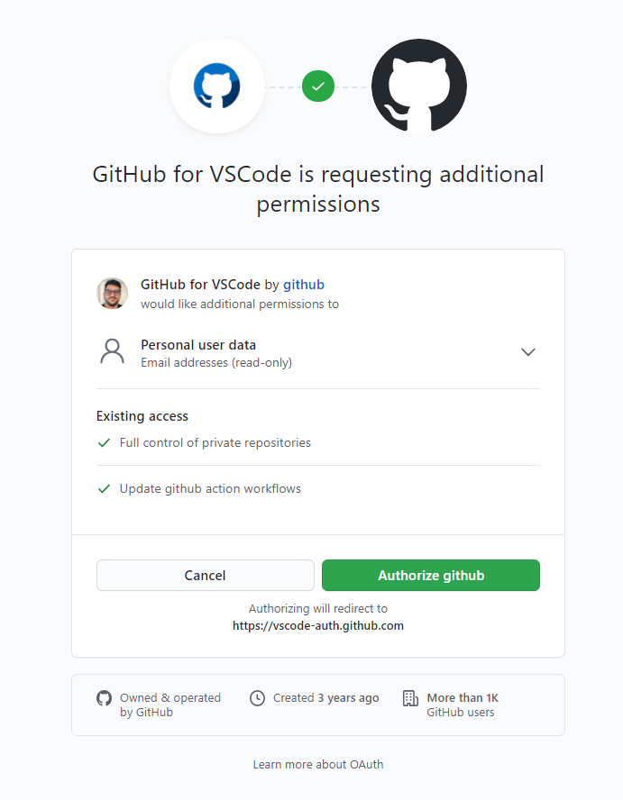
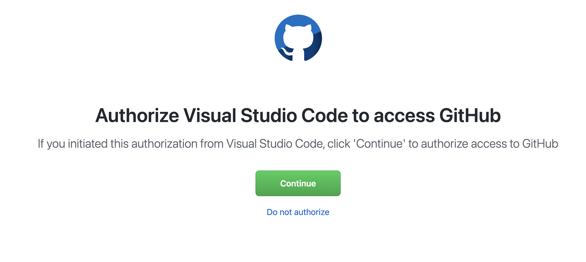
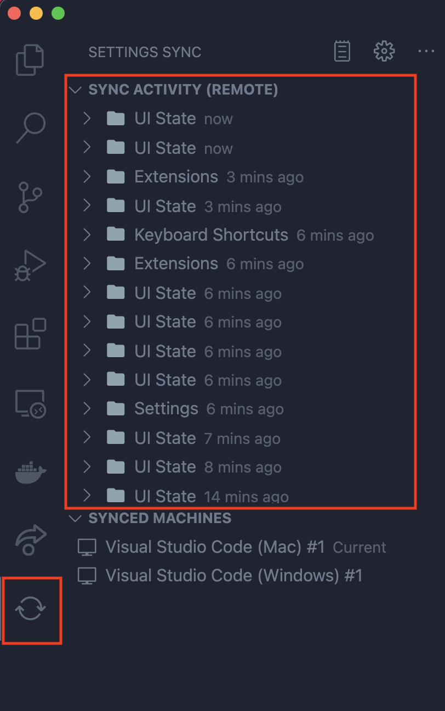

# Sincronización Configuración Visual Studio Code

En este documento se describrirán los pasos para poder tener la configuración de nuestro VSCode en diferentes dispositivos.

Se usarán dos dispositos para probar que funciona.

## Configurando primer dispositivo

El primer dispositivo será donde iniciemos una cuenta por primera vez y seguiremos los siguientes pasos:

- Lo primero que haremos será ir a las opciones de VSCode y activaremos la sincronización de la configuración.

  

- Una vez ahí se nos abrirá una ventana donde elegiremos cuales serán las configuraciones que queremos sincronizar.

  

- Cuando aceptemos, tendremos que elegir con que cuenta acceder, si con la de Microsoft o Github. En este caso se ha usado la de Github.

  

- Esto nos enviará a navegador para aceptar la autorización de usar la cuenta de github.

  

___

  

- Una vez le demos la autorización nos dará la opción de volver al editor.

  

- Ahora ya tendremos toda nuestra configuración en la nube para sincronizar con otro dispositivo

 

## Configurando Segundo Dispositivo

Ahora pasaremos a configurar el segundo dispositivo para que tenga la misma configuración que el primer dispositivo.

Para esto haremos exactamente los mismos pasos que antes.

Una vez hecho estos pasos como con el primer dispositivo volveremos al editor y veremos que está con la misma configuración que el dispositivo 1

Ya podremos usarlo sin problemas y con la misma configuración que tenemos en todos nuestros dispotivos

 

## Fallo en la sincronización

En el caso de que te falle la sincronización y te desaparezca al sincronizar 2 dispositivos no habrá ningún problema, ya que se guarda un historial de la configuración que se ha ido sincronizando.

Esto se usará de la siguiente manera:

- Iremos a las opciones de la configuración

 

- Luego de esto nos saldrá una ventana donde elegiremos la opción de `show synced data` para que se nos añada a nuestro editor en la barra izquierda.

  

- Ahora veremos como nos aparece esta opción y podemos ver un historial de la sincronización de la configuraicón.

  

Si queremos volver a una configuración pasada simplemente tendremos elegir la carpeta que deseemos del momento que queramos recuperar y darle a la flecha de restaurar que nos saldrá a la derecha y ya lo tendremos.

  
