Óscar Moreira Estévez

# Git Windows
___
  

___

## Explicación

Para poder usar github como lo usamos en *Linux* con claves *RSA* y con los comandos para subir archivos a *Github* tendremos que usar la herramienta `Git`, ya que nos proporcionará tanto todos los comandos necesarios como incluso la posibilidad de crear claves RSA.

Luego una vez instalado Git en windows pasaremos al tutorial que explica de forma general como empezar a configurarlo.

## 1. Instalación Git

- Para poder instalar `git` en windows lo primero será ir a la página http://gitforwindows.org/ y descargarlo.

  

- Una vez descargado lo ejecutaremos para empezar la instalación.

- Seguiremos la instalación como en los siguientes pasos que veremos a continucación:
  > En la primera captura yo elijo esa ruta ya que tengo dos discos de almacenamiento.

    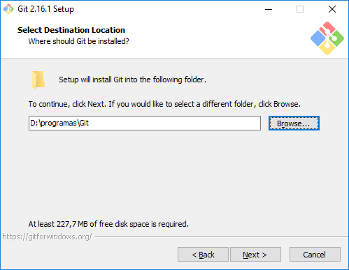

    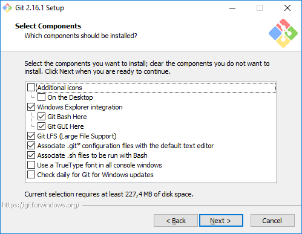

    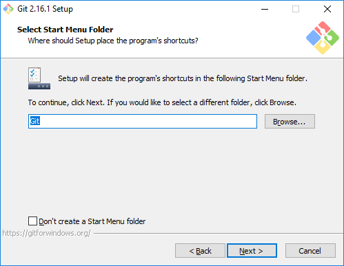

    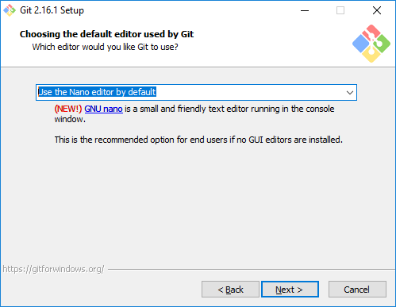

    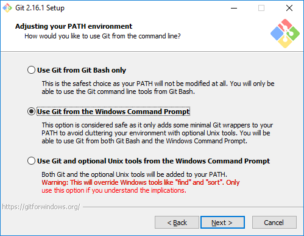

    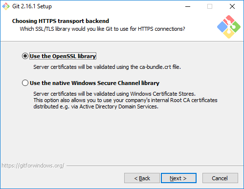

    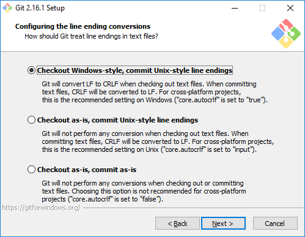

    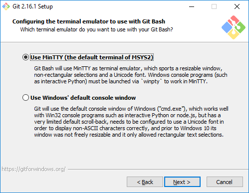

    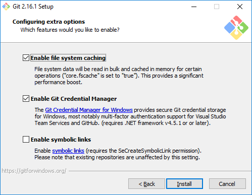

    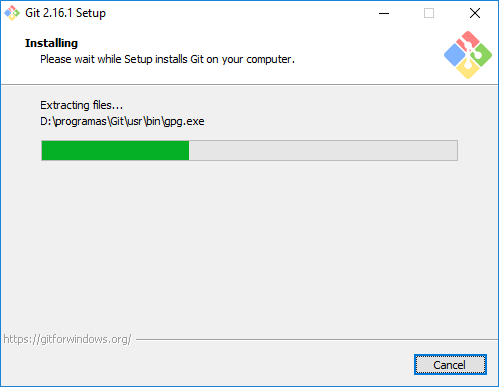

- Hecho todo esto ya estaría instalado asi que abriremos el programado llamado `Git Bash` y se nos abrira una consola.

  > Tener en cuenta que esta consola usa comandos de Linux.

  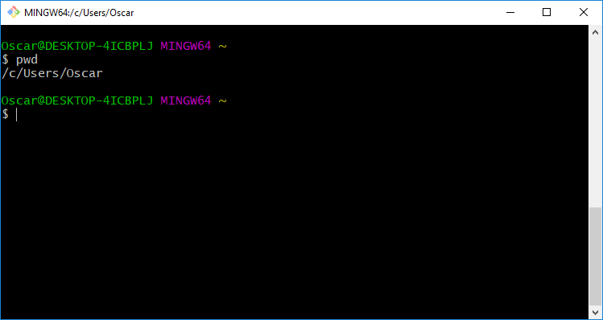

___
---

Ahora seguiremos con el [tutorial de configuración](https://github.com/omorest/Guides/blob/master/github/README.md) general.
