Óscar Moreira Estévez

# Github Windows y Claves RSA
___
  

___

## Explicación

Para poder usar github como lo usamos en *Linux* con claves *RSA* y con los comandos para subir archivos a *Github* tendremos que usar la herramienta `Git`, ya que nos proporcionará tanto todos los comandos necesarios como incluso la posibilidad de crear claves RSA debido a que funciona como una consola de *Linux*
## 1. Instalación Git

- Para poder instalar `git` en windows lo primero será ir a la página http://gitforwindows.org/ y descargarlo.

  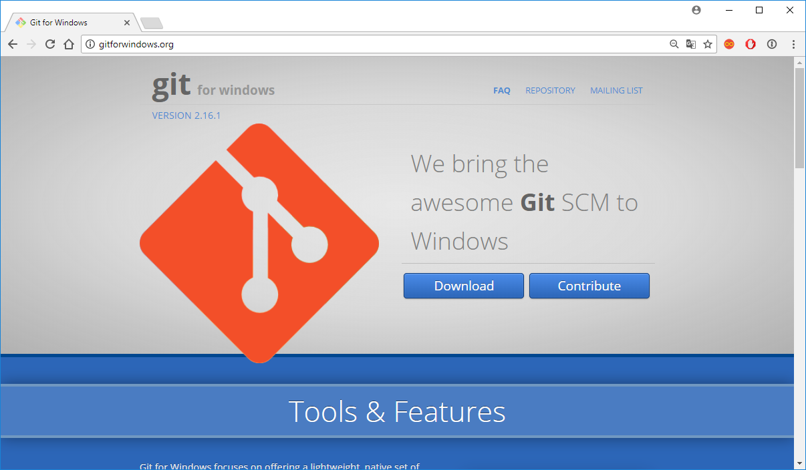

- Una vez descargado lo ejecutaremos para empezar la instalación.

- Seguiremos la instalación como en los siguientes pasos que veremos a continucación:
  > En la primera captura yo elijo esa ruta ya que tengo dos discos de almacenamiento.

    

    

    

    

    

    

    

    

    

    

- Hecho todo esto ya estaría instalado asi que abriremos el programado llamado `Git Bash` y se nos abrira una consola.

  > Tener en cuenta que esta consola usa comandos de Linux.

  

___

## 2. Claves RSA

- Sabiendo que esta consola de *Git* funciona como una de *Linux* podremos generar nuestras claves RSA con el comando `ssh-keygen`.

  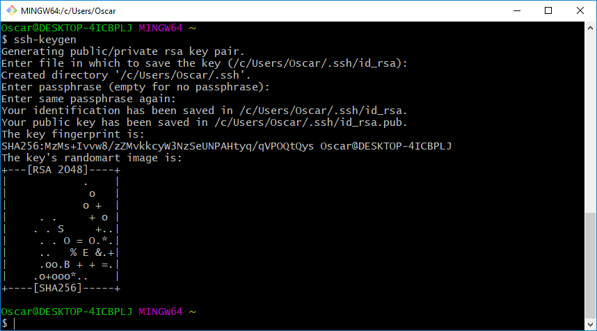

- Teniendo esto hecho veremos con el comando `ls -a` que el directorio principal `/c/Users/nombre_usuario` nos encontraremos una carpeta llamada `.ssh`.

  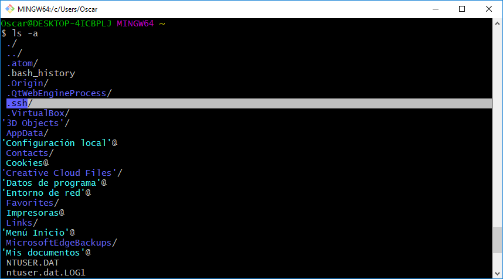

- si ejecutamos el comando `ls` dentro de la carpeta *.ssh* veremos que tenemos una clave publica y otra privada.

  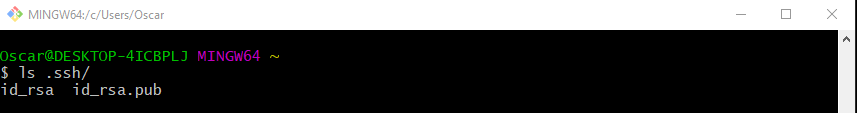

- ahi estarán nuestras claves que usaremos para unir con `Github`.

___

## 3. Github con Windows

### 3.1 Configuración

- Para la configuración básica tendremos que ejcutar los siguientes comandos en la consola `Git Bash`:
  ```
  - git config --global user.email "email"
  - git config --global user.name "nombre"
  - git config --global push.default simple
  ```

### 3.2 Claves en Github

Teniendo ya las claves creadas con nuestra consola `Git Bash` pasaremos a darle nuestra clave pública a nuestro *Github*.

- Para esto En el directorio `.ssh` donde se encuentran nuestras claves ejecutaremos el comando `cat id_rsa.pub`, de esta manera veremos el contenido de la clave y lo copiamos.

  > El nombre de la clave puede ser diferente pero ese es el nombre por defecto.

- Una vez copiada todo el contenido de la clave pública iremos a nuestro *Github*.

- Dentro de nuestro *Github* iremos arriba a la derecha a nuestra imagen y entraremos en `settings` --> `SSH and GPG Keys`.

  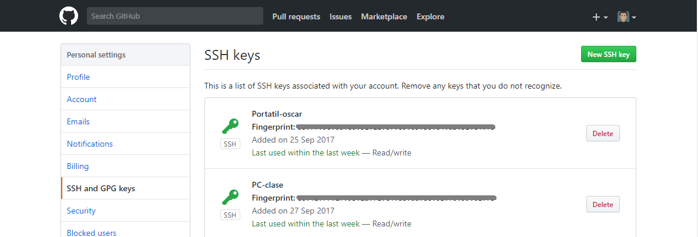

- Ahora iremos donde pone `New SSH Key` y le pondremos un nombre para saber a que pertenece y luego pegaremos la clave pública que hemos copiado.

  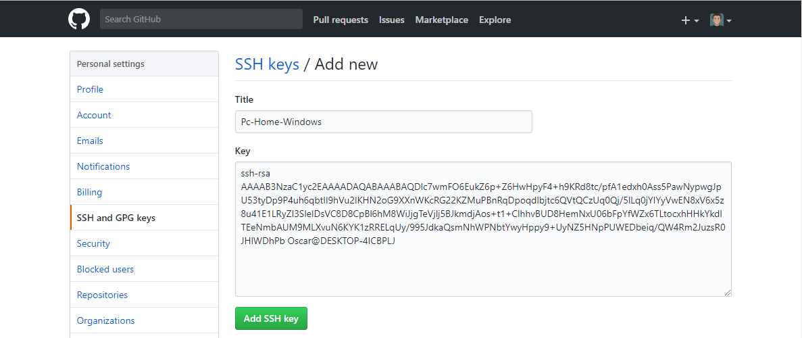

- Con esto hecho ya tendriamos la parte de las claves hecha.

___

## 4. Repositorio en Windows

- Ahora iremos a un repositorio que querramos tener en nuestro PC y una vez dentro del repositorio iremos al botón verde llamado `Clone or download` y copiaremos el texto que esta en la opción que se llama `Clone with SSH`.

  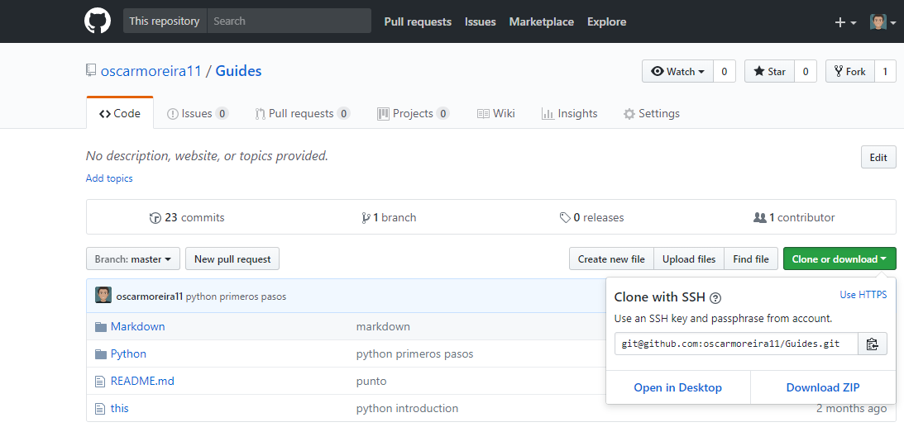

- Copiado el enlace del repositorio para usar por SSH iremos a la consola `Git Bash` y en la ruta que deseemos que se nos descargue el repositorio ejecutaremos el comando `git clone` junto al enlace copiado.

  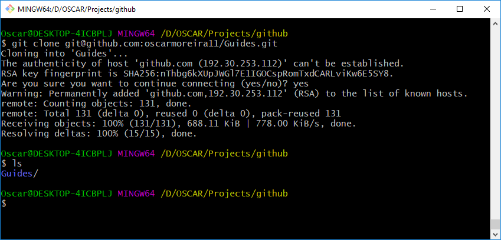

- Vemos que ha funcionado correctamente.

## 5. Comprobación de funcionamiento.

- Para comprobar que funciona pondremos un nuevo archivo en la carpeta del repositorio o modificamos alguno para subirlo  al repositorio de *Github* desde nuestro PC windows con la herramienta `Git Bash`.

- Una vez modifiquemos algo dentro de la carpeta del repositorio si ejecutamos el comando `git status` estando dentro del repositorio en la consola Git veremos que ya nos sale que se ha modificado algo.

  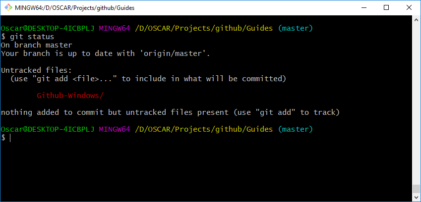

- Luego de esto ejecutaremos los comandos: `git add` junto al fichero que queremos subir y el comando `git commit -m "texto_significativo"` para añadirle como un guardado en el tiempo (como un punto de restauración).

  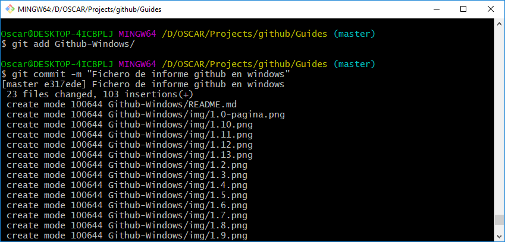

- Por último ejecutaremos el comando `git push` para subirlo.

- Con esto ya tendremos lso cambios subidos.

  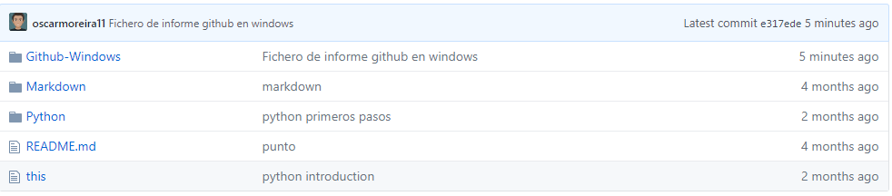

___
___

Fín del informe
