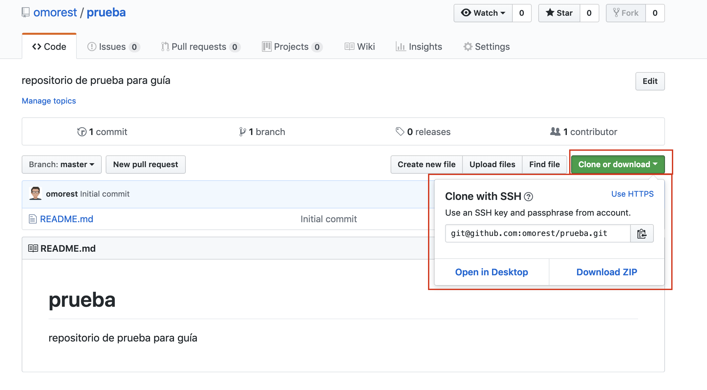

# Instalación,Configuración y uso básico de Git y GitHub. (Linux / Mac / Windows)

---

# Índice

1. [Instalación de Git](#id1)

2. [Configuración de Git](#id2)

3. [Creación de claves pública/privada](#id3)

4. [Uso básico de Git con github](#id4)

  - 4.1. [Creación de repositorio](#id4.1)

  - 4.2. [Clonar repositorio](#id4.2)

  - 4.3. [Comandos principales para uso](#id4.3)

---
---

## 1. Instalación de Git

Lo primero que haremos será instalar git en nuestro ordenador.

- **Linux :** desde la terminal.

    ~~~
      - sudo apt-get update         //Actualizamos los repositorios
      - sudo apt-get install git    //Instalamos Git
    ~~~

- **Mac :**

  - La forma más sencilla es usar el instalador gráfico de Git, que puedes descargar [aquí](http://sourceforge.net/projects/git-osx-installer/)

  - La segunda alternativa es Homebrew (http://brew.sh/). Si ya tienes instalado Homebrew, instala Git con: `brew install git`

- **Windows :**

  - ***Opción 1 :*** Si tenemos **Windows 10** podremos instalar la terminal de Ubuntu desde la *Microsoft Store* y funcionará como una terminal completa de *Linux* .

  - ***Opción 2 :*** Instalar la consola de Git como en el tutorial entero que explico [aquí](https://github.com/omorest/Guides/blob/master/github/Github-Windows/README.md).

    Una vez instalada se puede seguir con este tutorial.

---

## 2. Configuración de Git

Una vez instalado Git en nuestro ordenador pasaremos a configurarlo, solo tendremos que ejecutar 3 comandos en la terminal:

  ~~~
  - git config --global user.name "nombre_usuario"
  - git config --global user.email "email"
  - git config --global push.default simple
  ~~~

___

## 3. Creación de claves pública/privada

Ahora lo que haremos en la configuración de github en nuestro PC *(linux / mac)* será crear una clave publica y privada para así cuando queramos subir algun archivo no sea necesario poner la contraseña.

- Abriremos la terminal de comandos y ejecutaremos el siguiente comando: `ssh-keygen`. Daremos enter a cada apartado dejando los valores por defecto.

  ~~~console
  MacBook-Pro-de-Oscar:~ oscarmoreira$ ssh-keygen
  Generating public/private rsa key pair.
  Enter file in which to save the key (/Users/oscarmoreira/.ssh/id_rsa):
  Created directory '/Users/oscarmoreira/.ssh'.
  Enter passphrase (empty for no passphrase):
  Enter same passphrase again:
  Your identification has been saved in /Users/oscarmoreira/.ssh/id_rsa.
  Your public key has been saved in /Users/oscarmoreira/.ssh/id_rsa.pub.
  The key fingerprint is:
  ---------------------------------------- oscarmoreira@MacBook-Pro-de-Oscar.local
  The key's randomart image is:
  +---[RSA 2048]----+
  | .      .        |
  |   o B @   .     |
  |      =          |
  |       .   * . = |
  |    .           o|
  |     = . O      .|
  |    o o = B +    |
  |                 |
  |                 |
  +----[SHA256]-----+
  ~~~

- Hecho esto nos habrá creado en el directorio raiz una carpeta llamada: `.ssh` que contendra nuestra clave pública y privada.

  ~~~console
  MacBook-Pro-de-Oscar:~ oscarmoreira$ ls -a
  .			.cups			Desktop
  ..			.docker			Documents
  .CFUserTextEncoding	.gitconfig		Downloads
  .DS_Store		.mume			Library
  .Trash			.npm			Movies
  .atom			.ssh			Music
  .bash_history		.vscode			Pictures
  .bash_sessions		Applications		Public

  MacBook-Pro-de-Oscar:~ oscarmoreira$ cd .ssh/
  MacBook-Pro-de-Oscar:.ssh oscarmoreira$ ls
  id_rsa		id_rsa.pub
  ~~~

- Ahora copiaremos el contenido de **id_rsa.pub**, podremos ver el contenido con el comando: `cat id_rsa.pub`

- Una vez copiado el contenido iremos a nuestro ***GitHub***, clicamos en nuestra foto de perfil nos dirigimos a `settings/SSH and GPG keys`

- Clicaremos en `New SSH Key`

  

- Luego le pondremos un nombre para saber a que ordenador pertenece la clave e introduciremos la clave copiada anteriormente.

  

Con esto ya tendriamos toda la configuración hecha de nuestro github con nuestro PC *(Mac / Linux)*.

___

## 4. Uso básico de Git con github

### 4.1 Creación de repositorio.

  Los repositorios serán como carpetas de proyectos que crearemos en ***Github*** para guardar nuestro programa o programas, carpetas, etc...

  > Nota: en la versión gratuita de Github tendremos repositorios ilimitados tanto públicos como privados.

  - Iremos a nuestro ***Github*** --> *Perfil* --> *Repositories*.

  - Una vez aquí dentro clicaremos en `new` para crear un nuevo repositorio.

    

  - Ahora le pondremos un nombre al repositorio, elegiremos si lo queremos público o privado, y marcaremos la casilla de inicializar con un *README*.

  > Nota: los repositorios privados solo podran tener 3 colaboradores con la versión gratis de Github.

  

  - Hecho esto veremos que nos lleva directamente el repositorio creado.

    

  - Si volvemos a nuestro `perfil/repositories` veremos que esta creado.

    

---

### 4.2 Clonar repositorio

Cuando hablamos de clonar un repositorio es copiarlo en tu ordenador de forma que este sincronizado y cuando hagas un cambio en tu ordenador puedas subir esos cambias o descargar cambios realizados que esten en Github pero no en tu ordenador.

- Iremos al repositorio que queremos clonar, y clicamos en `clone or download` y copiamos el enlace que nos sale.

  > Si copiamos el https nos obligara a poner el usuario y la contraseña siempre, en cambio con el ssh detectare que tenemos configurado las claves públicas y privadas y no hará falta introducir los datos.

  

- Ahora abriremos la terminal  e iremos al directorio donde queremos tener el clonado y ejecutaremos el comando: `git clone git@github....`

  > Consejo: crear una carpeta llamada github en tu ordenador y dentro meter los repositorios.

  ~~~console
  MacBook-Pro-de-Oscar:Documents oscarmoreira$ ls
  github
  MacBook-Pro-de-Oscar:Documents oscarmoreira$ cd github/
  MacBook-Pro-de-Oscar:github oscarmoreira$ git clone git@github.com:omorest/prueba.git
  Cloning into 'prueba'...
  remote: Enumerating objects: 3, done.
  remote: Counting objects: 100% (3/3), done.
  remote: Total 3 (delta 0), reused 0 (delta 0), pack-reused 0
  Receiving objects: 100% (3/3), done.

  MacBook-Pro-de-Oscar:github oscarmoreira$ ls
  Guides	prueba
  MacBook-Pro-de-Oscar:github oscarmoreira$ cd prueba/
  MacBook-Pro-de-Oscar:prueba oscarmoreira$ ls
  README.md
  MacBook-Pro-de-Oscar:prueba oscarmoreira$ cat README.md
  # prueba
  repositorio de prueba para guía
  ~~~

Como vemos ya con estos dos simples pasos tenemos clonado el repositorio en nuestro ordenador de tal forma que siempre tendremos los archivos tanto en ***GitHub*** como en nuestro ordenador.

---

### 4.3 Comandos principales para uso

En este apartado veremos los comandos principales que usaremos para poder subir los ficheros o descargar de ***GitHub***.

  > Estos comandos se deben ejecutar en la terminal estando dentro del directorio del repositorio.

  - `git status` : comprobar si hay ficheros aún por subir al repositorio de Github. Si no se han subido saldrá una lista de los ficheros en los que han habido cambios.

  - `git add fichero o ruta` : añadir el fichero que se ha modificado para subirlo a github.

  - `git commit -m "comentario"` : comando para poner un comentario sobre el cambio hecho, la version, etc...

  - `git push` : Comando para subir el fichero a Github.

  - `git pull` : comando para actualizar tu carpeta del repositorio del ordenador descargando los ficheros o cambios nuevos.
