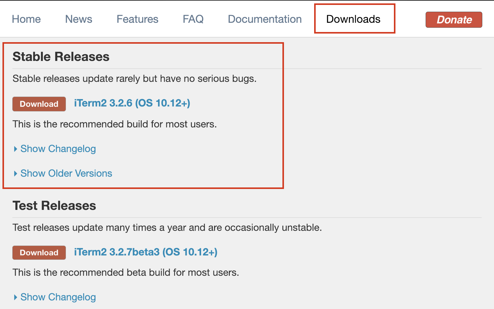
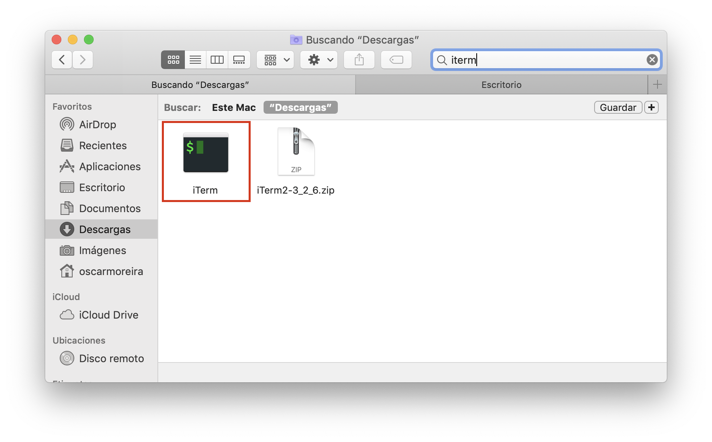
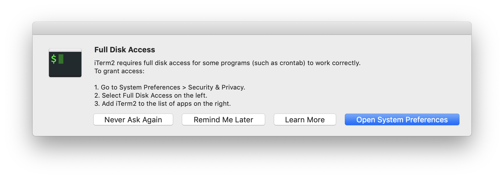
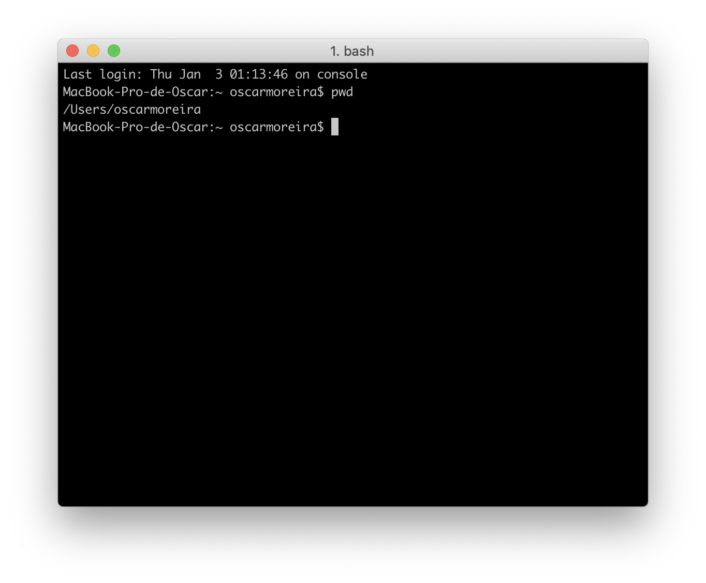

# iTerm 2

---

## 1. Descarga de iTerm2

- Para comenzar con la decarga iremos a la página oficial de *iTerm* al apartado de [Downloads](https://www.iterm2.com/downloads.html) donde descargaremos la versión ***recomendada*** y no la beta.

  

## 2. Instalación

- Una vez los descarguemos veremos que se nos descarga un archivo *.zip* el cual hay que descomprimir.

- Cuando lo hayamos descomprimido veremos que nos saldrá un icono de ***iTerm***.

- Al ejecutarlo veremos que nos pedirá que le demos permisos así que se los daremos.

- Una vez dados los permisos ya podemos usar ***iTrerm*** como una terminal normal.

