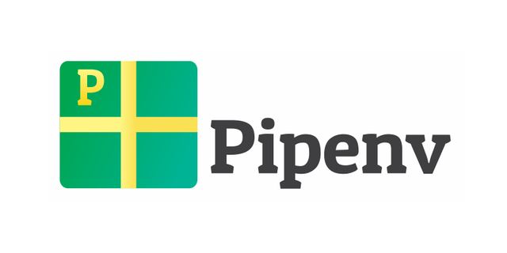

# Pipenv
___

Necesario python3 y pip

Instalamos pipenv: `pip install pipenv`

~~~console
oscarmoreira@MacBook-Pro-de-Oscar:~/Documents/github/TwitterBot(master) 
$ pip install pipenv
Collecting pipenv
  Using cached pipenv-2018.11.26-py3-none-any.whl (5.2 MB)
Requirement already satisfied: pip>=9.0.1 in /Library/Frameworks/Python.framework/Versions/3.7/lib/python3.7/sit
e-packages (from pipenv) (20.0.2)
Requirement already satisfied: certifi in /Library/Frameworks/Python.framework/Versions/3.7/lib/python3.7/site-p
ackages (from pipenv) (2019.3.9)
Collecting virtualenv-clone>=0.2.5
  Using cached virtualenv_clone-0.5.3-py2.py3-none-any.whl (6.6 kB)
Collecting virtualenv
  Downloading virtualenv-20.0.2-py2.py3-none-any.whl (4.6 MB)
     |████████████████████████████████| 4.6 MB 1.2 MB/s 
Requirement already satisfied: setuptools>=36.2.1 in /Library/Frameworks/Python.framework/Versions/3.7/lib/pytho
n3.7/site-packages (from pipenv) (40.6.2)
Collecting appdirs<2,>=1.4.3
  Downloading appdirs-1.4.3-py2.py3-none-any.whl (12 kB)
Collecting filelock<4,>=3.0.0
  Downloading filelock-3.0.12-py3-none-any.whl (7.6 kB)
Collecting distlib<1,>=0.3.0
  Downloading distlib-0.3.0.zip (571 kB)
     |████████████████████████████████| 571 kB 14.8 MB/s 
Collecting importlib-metadata<2,>=0.12; python_version < "3.8"
  Downloading importlib_metadata-1.5.0-py2.py3-none-any.whl (30 kB)
Requirement already satisfied: six<2,>=1.12.0 in /Users/oscarmoreira/Library/Python/3.7/lib/python/site-packages
 (from virtualenv->pipenv) (1.12.0)
Collecting zipp>=0.5
  Downloading zipp-2.2.0-py36-none-any.whl (4.6 kB)
Installing collected packages: virtualenv-clone, appdirs, filelock, distlib, zipp, importlib-metadata, virtualen
v, pipenv
    Running setup.py install for distlib ... done
Successfully installed appdirs-1.4.3 distlib-0.3.0 filelock-3.0.12 importlib-metadata-1.5.0 pipenv-2018.11.26 vi
rtualenv-20.0.2 virtualenv-clone-0.5.3 zipp-2.2.0
~~~